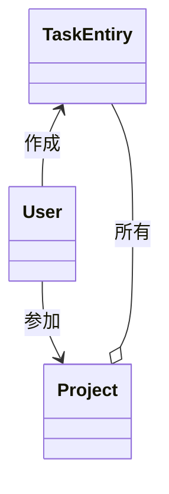

# ドメインとは
ソフトウェアを作っていても、ドメインという概念に馴染みがない人も多いのではないだろうか？
自分は初めてドメインという概念を知った時、あまりイメージがわかなかった。

何がドメインで、何がドメインではないのか？見分けがつかない。
ソフトウェア開発をある程度やってると、これがドメインだと感覚的にわかってきた。

その感覚的に身につけたドメインかどうかの識別方法は、そのソフトウェアにしかない特別なコードかどうか？
という問いにTrueを返すものはドメインであるというものだ。
一般に言われるドメインの定義はもう少し複雑そうであるが、感覚的にはそのような感じでドメインぽいかどうかを判断している。

# ドメインモデルとは
ドメインモデルとは、ソフトウェア固有のコード(ドメイン)をクラスを用いて、そのデータ構造と振る舞いを定義したものという認識だ。これもアバウトな理解ではあるが、実装的にはそういうことになるだろう。

本記事はドメインモデルリングをしてみることが趣旨なので、詳しい説明や厳密な説明は省略する。

# タスク管理アプリ
ドメインモデリングをするためには、ドメインが必要だ。テーマはなんでもいいが、ドメインのことをある程度知らないと、モデリングすることはできない。
なので今回はソフトウェア開発のための、タスク管理アプリをテーマにしてみようとおもう。

## アプリの要件 - Step1
ソフトウェア開発のためのタスク管理アプリを作成する。

アプリを作ろうと思い至った背景には、次のような理由がある
+ ソフトウェア開発の進捗状況がチャットやスプレッドシートなどに散らばってしまい把握しにくい
+ 作業内容、見積もり、実際の作業量を一貫して把握しにくい
+ タスクの起票、着手、テスト、受け入れ、デプロイといった工程をシステム化したい

上記のような背景を念頭に置いて、インクリメンタルにアプリの要件を考えることにした。
とりあえず最初のステップでは、次のような仕様を実装することにした。

+ ユーザーはプロジェクトを作成できる
+ ユーザーはプロジェクトに他のユーザーを参加させることができる
+ ユーザーはプロジェクトにタスクを追加できる

これはだいぶ簡略化した要件だが、おおよそこんなようなことができる。
適当なデータを閲覧することも可能だが、要件としてはとりあえず省略する。
なお、実装にはFlutterを使うことを前提にDartを使用する。Dart特有の機能については軽く説明を入れるつもりだ。

## ドメインモデリング - Step1
さてドメインモデリングを行う上で重要なのは、要件に登場する用語である。
今回出てきたのは、ユーザー、プロジェクト、タスクの3つである。
これらはソフトウェアを構成する重要な要素である可能性が高いので、クラスとして表現する。

### Userクラス
```dart
class User {
  final UserId id;

  User({
    required this.id,
  });
}

extension type UserId(String value) implements String {}
```
これはユーザーを表現するクラス。
今の所、UserクラスはUserIdのみを持つ。UserId型はDart言語のextension typeという機能で、ほとんどString型だと考えもらって構わない。

### Projectクラス
同様にして、プロジェクトも定義する。
```dart
class Project {
  final ProjectId id;
  final List<UserId> memberIds;

  Project({
    required this.id,
    required this.memberIds,
  });
}
```
ProjectがUserと違うのは、ProjectはmemberIdsとして、UserIdのリストを持っていることだ。
これは、ユーザーがプロジェクトに参加できるという要件を表現したものである。

ドメインモデリングではこのように他のモデルのIDを持つことで互いの関係を定義していくというのが重要な作業の一つだ。

### TaskEntiryクラス
タスクも作成する。タスクはFlutterの内部のクラスにもTaskという名前のものがあり、取り回しが悪いので、TaskEntryという名前にすることにする。

```dart
class TaskEntry {
  final TaskEntryId id;
  final ProjectId projectId;
  final UserId creatorId;

  TaskEntry({
    required this.id,
    required this.projectId,
    required this.creatorId,
  });
}
```
タスクはプロジェクトに対して作られるので、ProjectIdを持つ。
またどのユーザーが作ったかを識別するために、UserIdも持つことにする。


クラス図風に書くとこんな感じの関係になる。適当だが。


### プロジェクトの作成
要件には、「ユーザーはプロジェクトを作成できる」とあるので、UserクラスにcreateProjectメソッドを追加する。

```dart
class User {
  ...略

  Project createProject() {
    return Project(
      id: ProjectId.create(),
      memberIds: [id],
    );
  }
}
```

ProjectIdは、プロジェクトを一意に識別するためのIDである。createメソッドは、新しいIDを生成するためのものである。
基本的には、UUIDを生成するようなものを想定している。

```dart

extension type ProjectId(String value) implements String {
  factory ProjectId.create() {
    return ProjectId(const Uuid().v4());
  }
}
```

### プロジェクトへの参加

次に、「ユーザーはプロジェクトに他のユーザーを参加させることができる」という要件を実装する。
この場合、ProjectクラスのmemberIdsにUserIdを追加することで実現できる。
「ユーザーは」という表現から、Userクラスにメソッドを追加するのが自然だと思うかもしれないが、必ずしもそうではない。
ドメインモデルはあくまで、ソフトウェアの振る舞いを表現するものであるので、言葉の表現に囚われる必要はない。
プロジェクトへのメンバーの追加には、招待する人とされる人のIdがあればよいので、Projectクラスにメソッドを追加することにする。

```dart
class Project {
  ...略

  bool isMember(UserId userId) {
    return memberIds.contains(userId);
  }

  Project addMember(UserId invitedUserId, UserId inviterUserId) {
    if (!isMember(inviterUserId)) {
      throw Exception('Only members can invite new members');
    }

    return Project(
      id: id,
      memberIds: [...memberIds, invitedUserId],
    );
  }
}
```

よくあるパターンだが、addMemberメソッドは、招待者がプロジェクトに参加しているかどうかを確認し、参加していない場合は例外を投げるようにしている。
このようにすることで、ドメインのルールを守ることができる。

### タスクの追加
次に、「ユーザーはプロジェクトにタスクを追加できる」という要件を実装する。
タスクの追加は、factoryメソッドを使って、TaskEntryを生成することで実現できる。
factoryはDart言語の機能で、コンストラクタとは異なり、インスタンスを生成するためのメソッドを定義することができる。
factoryがない言語では、staticメソッドを使って同じようなことを実現することができる。

```dart
class TaskEntry {
  ...略

  factory TaskEntry.create(ProjectId projectId, UserId creatorId) {
    return TaskEntry(
      id: TaskEntryId.create(),
      projectId: projectId,
      creatorId: creatorId,
    );
  }
}
```

TaskEntryIdもProjectIdと同様に、新しいIDを生成するためのcreateメソッドを持つ。
タスクの作成時には必ずcreateメソッドを使うことで、作成時のルールを守ることができる。
作成時のルールは、IDの生成方法だけでなく、他にも様々なものがあるだろう。
例えば、作成日時を設定する、タスクの状態を初期化する、などが考えられる。


